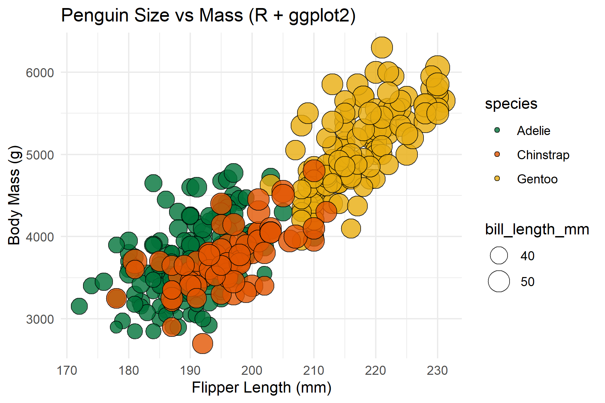
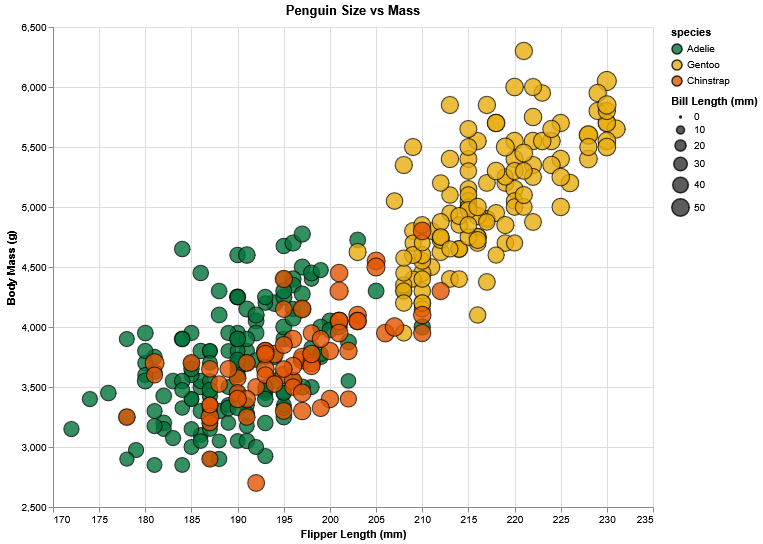
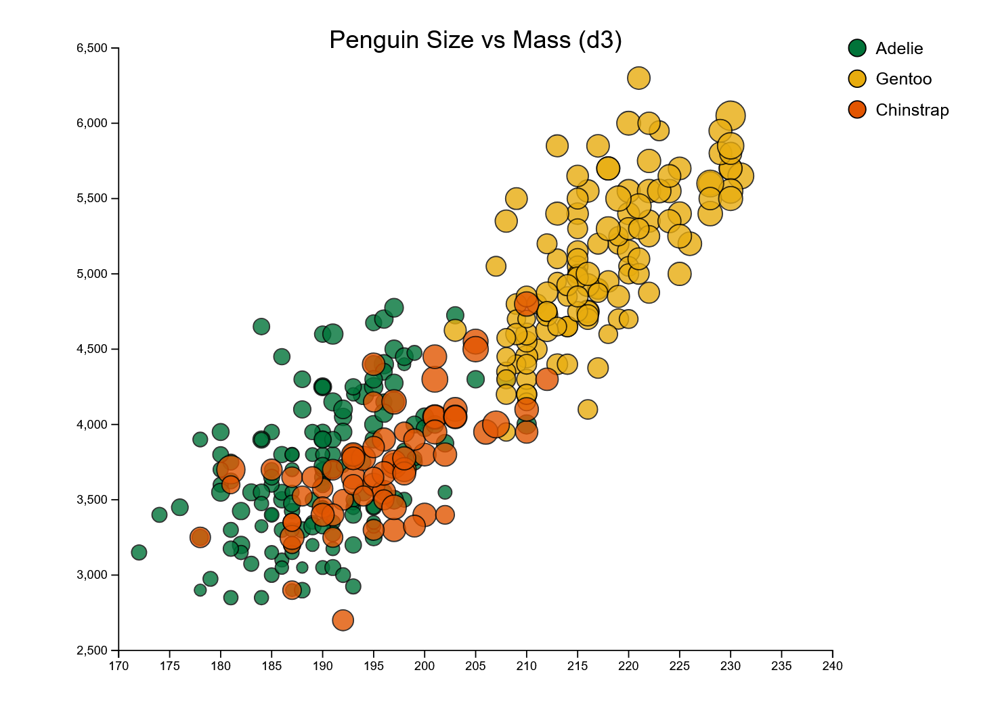
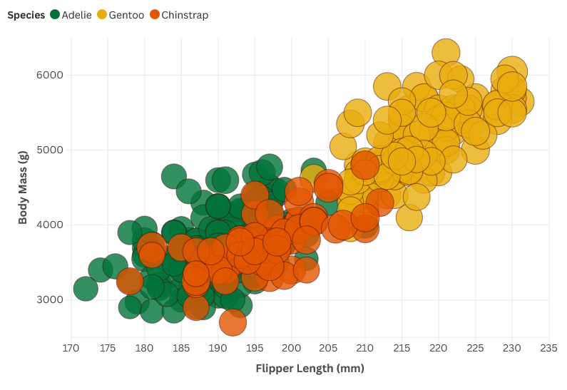

# Assignment 2 - Data Visualization, 5 Ways

**Conor McCoy**

For this assignment, I used five different tools to create the same scatterplot. I used a mix of coding tools (R, Python, JavaScript) and drag-and-drop tools (Tableau, Flourish) to see which ones were faster or easier to use.

## 1. R + ggplot2

R was one of the fastest coding solutions. The library `ggplot2` is built specifically for this kind of task, so I only needed a few lines of code to map the data to the chart.
- **Pros:** Very short code. It was easy to customize the colors and borders of the dots.
- **Cons:** You have to install RStudio, which takes a bit of setup if you haven't used it before.
- **Verdict:** Great for making clean, professional looking charts quickly if you know the syntax.

## 2. Altair (Python)

Altair is a Python library that felt like a middle ground between coding and configuring. Since I already know Python, this was straightforward to set up.
- **Pros:** It works well with standard data tools like Pandas. I was able to make the chart interactive (zoom and pan) with just one extra command.
- **Cons:** The error messages can be a little confusing if you miss a comma or a bracket.
- **Verdict:** A solid choice if you are already working in Python and want a quick interactive chart.

## 3. D3.js

D3 was the most difficult tool by far. Unlike the others, D3 doesn't "know" what a chart is; you have to manually draw the axes, the scales, and every single dot yourself.
- **Pros:** You have complete control. I could put the legend where I wanted it and customize how the mouse interaction worked.
- **Cons:** It takes a lot of code to do simple things. I also had to run a local web server just to load the CSV file, which added an extra step.
- **Verdict:** Too much work for a simple scatterplot, but viable if you need to build something custom.

## 4. Tableau

Tableau was the second fastest tool to use. I didn't have to write any code; I just dragged the variables to the columns and rows.
- **Pros:** Quick to make the graph, might've been the fastest if I had used it before
- **Cons:** It can be annoying to customize small details, like specific colors or borders, because the tool tries to do everything for you automatically.
- **Verdict:** The best tool for quickly exploring data without needing to program.

## 5. Flourish.

Flourish is a web-based tool and was the fastest tool, so I didn't have to install anything. I just uploaded my file and picked "Scatter Plot."
- **Pros:** Zero setup required. The default animations and styles look good right away.
- **Cons:** If the settings menu doesn't have the option you want, you can't add it
- **Verdict:** Good for when you need a nice-looking chart immediately and don't care about deep customization.

---

## Technical Achievements
- **Interactive Altair:** I enabled zooming and panning in the Altair chart. This lets users explore the data by dragging the chart around or scrolling to zoom in.
- **Custom D3 Tooltips:** In the D3 version, I wrote a script to make a popup box appear when you hover over a dot. It shows the exact species and mass of that penguin.
- **Manual Legend in D3:** Since D3 doesn't make legends automatically, I wrote code to manually draw the colored circles and text labels on the right side of the chart.

## Design Achievements
- **Consistent Color Palette:** I didn't use the default colors for each tool. Instead, I manually set the colors to be the same across all five charts (Green, Gold, and Orange) so they look consistent.
- **Handling Overlap:** Since many data points overlapped, I set the transparency (opacity) to 80% on all charts. This makes sure you can see clusters of penguins clearly instead of just a solid block of color. I also added a black border around each of the points (circles), further enhancing the visual clarity.
